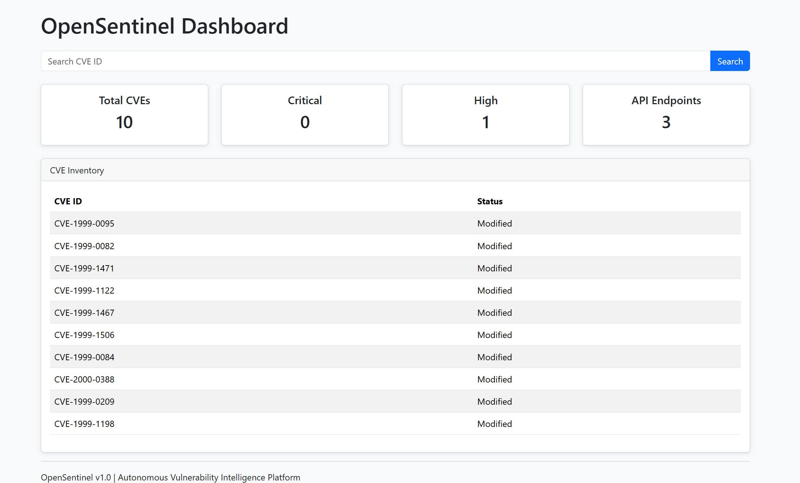

# OpenSentinel

Autonomous Vulnerability Intelligence Platform built with Python and Flask.

## Overview

OpenSentinel is a security-focused application that collects vulnerability intelligence from the National Vulnerability Database (NVD), processes CVE information, classifies risk, exposes REST APIs, and presents findings through a web dashboard.

## Features

- NVD CVE Collection
- CVE Report Generation
- CVSS Risk Classification
- CVE Search
- REST API
- Dashboard Analytics
- CSV Export
- SQLite Foundation
- Security Advisory Templates

## Architecture

NVD API
↓
CVE Collector
↓
JSON Processing
↓
Risk Classification Engine
↓
REST API
↓
Flask Dashboard

## Technology Stack

- Python
- Flask
- Bootstrap 5
- SQLite
- JSON

## Dashboard Screenshot

## API Endpoints

### Get All CVEs

/api/cves

### Get Single CVE

/api/cves/<cve_id>

Example:

/api/cves/CVE-1999-0095

### Statistics

/api/stats

## Project Structure

collectors/
dashboard/
database/
exports/
risk-engine/
templates/
static/
reports/
advisories/

## Future Roadmap

- CVSS Trend Analytics
- SQLite Data Persistence
- CSV Download from Dashboard
- Authentication and User Management
- PDF Report Generation
- Vulnerability Trend Visualizations

